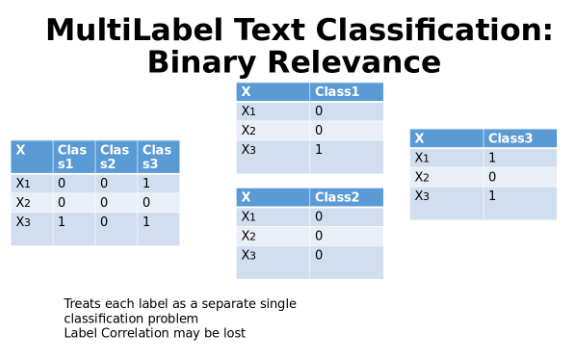
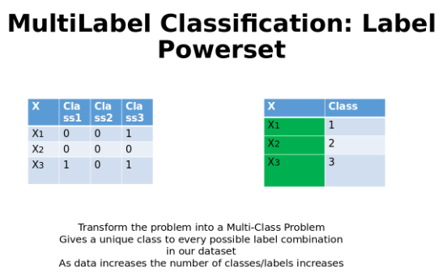
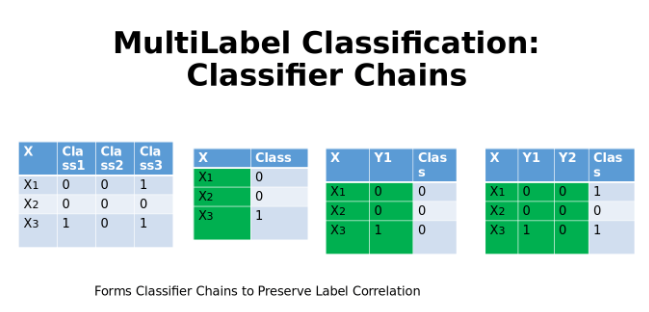
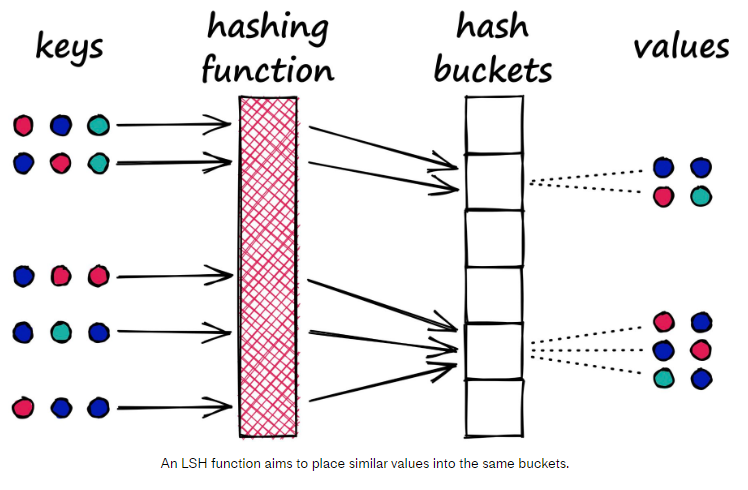
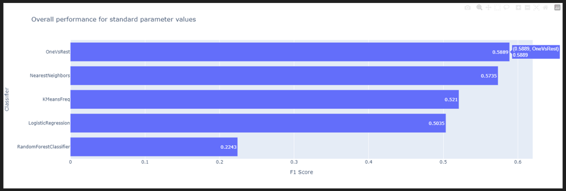
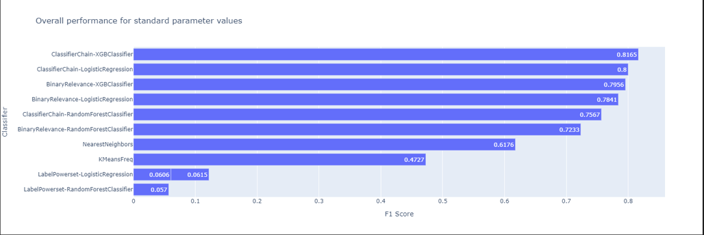
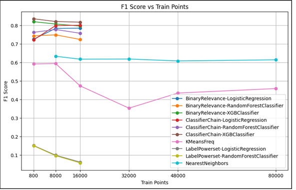

# Automatic Post Tagging

In this project, we build machine learning models in order to predict the tags of stackoverflow.com posts using PySpark and sklearn.

## Contents

- [Motivation](#motivation)
- [Summary](#summary)
- [Methodology](#methodology)
    - [1. Problem Transformation Methods](#1-problem-transformation-methods)
    - [2. Approximate kNN Search](#2-approximate-knn-search)
    - [3. k-Means Frequency Classification](#3-k-means-frequency-classification)
- [Key results](#key-results)
	- [Best results come from problem transformation methods](#best-results-come-from-problem-transformation-methods)
		- [Pyspark: One-vs-Rest classifier achieves best $F_{1}$ score](#pyspark-one-vs-rest-classifier-achieves-best-score)
		- [Python: XGBoost with Classifier Chains achieves best $F_{1}$ score](#python-xgboost-with-classifier-chains-achieves-best-score)
	- [Learning Curves: Overfitting](#learning-curves-overfitting)

## Motivation

The area of text analytics (or text mining) includes techniques from a multitude of scientific areas (A.I.,
statistics, linguistics), and it has a wide range of applications (security, marketing, information
retrieval, opinion mining). While structured data are “ready” for analysis and evaluation,
unstructured text requires transformation in order to uncover the underlying information. The
transformation of unstructured text into a structured set of data is not a straight forward task and
text analytics offers a wide variety of tools to tackle with the idioms, ambiguities and irregularities
of natural language. 

In this project, we will tackle a problem that involves text analysis and
feature extraction from text data. The particular task is focused on a multilabel classification task.
This is a task where each instance of the data may be assigned multiple labels. This is different than
a multiclass task where each instance may be assigned only one label (which takes multiple values).

## Summary

In this project, we were given a large dataset which consisted of questions and answers of posts at [stackoverflow.com](https://stackoverflow.com/).

Every question in that platform is tagged with a few keywords that we will consider as labels of the text in the title and body of the question. For our task we have limited the size of the dataset by
maintaining only questions (their title and main body of text) that have either of the following tags:
'javascript', 'css', 'jquery', 'html'. The goal of this project is to train machine learning models that finds the tags of a post given its title and body.

To tackle this problem we employed the following methods:

1. Problem transformation methods:

    a. Binary Relevance

    b. Label Powersets

    c. Classifier Chains

2. Approximate Nearest Neighbour Search.

3. k-Means Frequency Classification.

For the evaluation of our models we used a variation of the $F_{1}$ score:

$$ F_{1} = \frac{1}{N}\sum_{i = 1}^{N} 2 \frac{\vert P_{i} \cap Y_{i} \vert}{\vert P_{i} \vert + \vert Y_{i} \vert} $$

where:
* $N$: Number of instances

* $P_{i}$: Set of predicted labels for instance $i$.

* $Y_{i}$: Set of real labels for instance $i$.
    

**Important**: For this project there were no restrictions regarding the programming language and/or framework to be used in order to get the results. Because the training data were very large (2.7 GB) we initially thought of using Pyspark so that we can take advantage of all the benefits it offers for big data. Since we did not have access to a cluster though, we were limited to running Pyspark in pseudo-distributed mode on Google Collab, which itself has limitations on the available RAM and CPU power available, resulting to experiments running *very* slowly. For that reason, we also developed most of our methods with "pure" python (`sklearn`) and ran them locally on a simple computer. As an extra part of this project we compare pyspark on Google Colab with simple python ran locally.

This project was completed within the scope of the 'Mining From Massive Datasets' course of the 'Data and Web Science' MSc programme of Aristotle University of Thessaloniki (AUTH) for the winter semester of 2023.

## Methodology

### 1. Problem Transformation Methods

Our original problem is a multilabel classification problem. This means that each training example has one *or more* labels. One simple way to approach such problems is to convert them to multiclass, were each training example is assigned *only one* label from a set of 1 or more possible labels. There are different methods to do that, but we implemented the following:

1. **Binary Relevance**: In this approach, each label in a multilabel classification problem is treated independently as a separate binary classification task. Essentially, it decomposes the problem into multiple binary classification subproblems, one for each label. During prediction, each binary classifier is used to make a separate prediction for its corresponding label. This way, multiple binary predictions are generated, and the presence or absence of each label is determined independently. This approach allows for the possibility of an instance being assigned multiple labels simultaneously.

    One caveat of this method is that it treats each label independently, i.e. it does not consider dependencies or correlations among labels.

    

[Image souce](https://www.section.io/engineering-education/multi-label-classification-with-scikit-multilearn/)

2. **Label Powerset**: In this approach, each unique combination of labels present in the training data is treated as a separate class. For example, if there are three labels (A, B, C), and in the training data,
instances are labeled with combinations like (A, B), (B, C), and (A, C), then these combinations will be considered as distinct classes. In this way, this method considers the interdependencies among labels and captures the relationship between different label combinations. 

    However, it can be computationally expensive and is susceptible to the curse of dimensionality when dealing with a large number of labels. Additionally, the label space can become extremely large, leading to potential data sparsity issues. Furthermore, there is also the issue of not including all possible label combinations in the model-fitting process, which leads to overfitting of the train set.

    

[Image souce](https://www.section.io/engineering-education/multi-label-classification-with-scikit-multilearn/)

3. **Classifier Chains**: In this approach, we build a chain of binary classifiers, where each classifier in the chain is trained to predict a specific label considering the predictions of previous classifiers in the chain as additional features. That way any interdependencies among labels is taken under consideration, without having the scaling issues of the Label Powersets method.

    However, the order of the labels in the chain can affect the performance of the approach. Choosing a meaningful order that reflects the underlying dependencies among labels is crucial for achieving good results.

    

[Image souce](https://www.section.io/engineering-education/multi-label-classification-with-scikit-multilearn/)

### 2. Approximate kNN Search

In this method, we first apply Locality Sensitive Hashing (LSH) to our data, and then for each instance we try to find its k approximate nearest neighbours. Then the tag(s) that appear with frequency more than some
frequency threshold (which is a parameter of this method) is assigned to the new example.

Locality-Sensitive Hashing (LSH) is a technique used to efficiently approximate similarity search in
high-dimensional spaces. It is particularly useful when traditional exact search methods become
computationally expensive due to the curse of dimensionality.

    

[Image souce](https://www.pinecone.io/learn/series/faiss/locality-sensitive-hashing/)

The main idea behind LSH is to hash similar data points into the same or nearby buckets with high
probability. This grouping of similar points allows for efficient retrieval of potential neighbors when searching for similar items. LSH achieves this by leveraging random projections or other proximity-preserving techniques.

### 3. k-Means Frequency Classification

In this method, we first apply the k-Means algorithm to cluster our data into k clusters. Then, for each cluster, we found the tags that appear with frequency more than a frequency threshold (which is a parameter of this method) and assigned these tags to the cluster. Finally, for each new instance, we find the centroid that is closest to it and assign it the tags that correspond to the cluster of that centroid.

## Key results

### Best results come from problem transformation methods

#### Pyspark: One-vs-Rest classifier achieves best $F_{1}$ score

    

#### Python: XGBoost with Classifier Chains achieves best $F_{1}$ score

    

We see tha problem transformation methods tend to perform better than the other 2. Regarding the value of the $F_{1}$ score, we see that our implementation in python clearly outperforms the one in pyspark, with the top models having an $F_{1}$ score of 0.59 for pyspark and 0.81 for simple python.

### Learning Curves: Overfitting

    

As we can see, the sheer volume of the data combined with our limited computational resources has limited how many training examples we can use for the training of our models, which results to the possibility of overfitting.

An exception to that seem to be the Nearest Neighbours and KMeansFreq classifiers: their learning curves seem to indicate that more training examples would not necessarily increase these models' performance, rather, more or better feature engineering may have a larger impact.

For the rest of the models, we would need to run more experiments to get a more clear picture, since we do not have enough data points.

